**Machine Learning in Geotechnical Engineering**

**Soil Layering by Cone Penetration Test Data and Autoencoder**

Zhiyan Jiang
([LinkedIn.com/in/zhiyanjiang](http://linkedin.com/in/zhiyanjiang))

September 20 2025

# 1. Introduction

Geotechnical site characterization is the fundamental process of
delineating existing subsurface conditions, including geological
stratification and engineering properties, which form the basis for
foundation and ground improvement design. To facilitate design
application, the outcome of this characterization is typically presented
as a sequence of discrete soil strata, each idealized as homogeneous
unit with constant engineering parameters. For sites where soil
constituents the primarily geological unit, accurate soil condition
assessment and the accompanied process of soil layering are
indispensable.

Soil conditions are routinely obtained through various in situ tests,
such as the standard penetration test (SPT), the flat dilatometer test
(DMT), and the cone penetration test (CPT). Among these tests, cone
penetration test is distinguished by small sampling intervals, high
sampling precision, and rapid deployment. These merits position CPT data
as a potentially optimal source for high-resolution soil layering.

Previous work explored the feasibility of various machine learning
techniques to automate soil layering based on CPT data (Reference 1).
The prior study concluded that among several models investigated, a
Random Forests (RF) regressor trained on aggregated soil behavior type
index (*I<sub>c</sub>*) exhibited the most consistent and accurate
performance, closely followed by an RF classifier model trained on Soil
Behavior Type (SBT) zone numbers based on the normalized
Q<sub>tn</sub>-F<sub>r ­­</sub>chart. The results of both models generally
aligned with human expert judgement.

Nevertheless, several deficiencies are identified in the implementation
and application of these ensembled-based machine learning models:

1\. Susceptibility to Data Noises: The models were sensitive to inherent
noise in raw CPT data, necessitating a filtering step such as a moving
average. This process distorts raw the data and introduces additional
hyper parameters (e.g., window lengths and repetition times), thereby
complicating the workflow.

2\. Incapacity to Manage profile Misalignment: Misalignment in CPT
profiles stems from the natural spatial variability of soil properties,
which causes the starting and ending depths of a specific layer to
change between locations. This variability renders single alignment of
CPT profiles by depth or elevation less rigorous. Consequently, soil
layers that are thin or have a low frequency of occurrence tend to be
overwhelmed and assimilated into a thicker, more frequently occurring
layers.

3\. Dependency on Universal Geotechnical Domain Knowledge: While domain
knowledge is crucial for soil classification, the universal
classification thresholds inherent in the I<sub>c</sub> index and SBT
zoning schemes often lack adaptability to local soil characteristics.
Furthermore, these methods do not process an inherent capability for
reasoning about soil unit transitions.

Moreover, the aforementioned ensemble-based models provide a general
layering outcome but cannot reliably recognize the same layer when it is
separated by other layers within a single profile, nor can they
consistently recognize a given layer across multiple profiles.
Therefore, continued exploration of more sophisticated machine learning
approaches is warranted.

The objective of the current study is to investigate the utility of
autoencoders, a type of deep learning architecture, for achieving robust
and automatic soil layering from CPT data with an acceptable level of
performance. The findings of this project are intended to contribute to
enhance efficiency, accuracy, and consistency in geotechnical site
characterization and development of automated geotechnical analytic
workflows.

# 2. Methodology

## 2.1 Problem formulation

Given a set of raw Cone Penetration Test (CPT) profiles, comprising
measurements such as cone resistance (*q<sub>c</sub>*) and sleeve
friction (*f<sub>s</sub>*), the objective is to segment the soil
subsurface into a sequence of distinct soil layers. These layers must
capture the essential geotechnical characteristics and exhibit both
intra-layer homogeneity (within a profile) and inter-profile consistency
(across different profiles).

This layering problem is formally formulated as a clustering problem
with a vertical continuity constraint. Specifically, CPT data points
exhibiting high similarity in their measurements must be aggregated into
the same soil layer. Once assigned, these data points must maintain
vertical continuity within the profile, reflecting the depositional
nature of geological strata. Furthermore, layers with equivalent soil
properties across multiple CPT soundings must be assigned the same
label, which is essential for developing a unified site model.

## 2.2 Dataset 

The dataset utilized for this project is compiled from a public CPT data
repository, which consists of 984 cone penetration test records
collected from various locations across the North America (Sanger et al.
2024).

For the purpose of developing and testing the autoencoder-based layering
methodology, three specific soundings – Profile 452, 453, and 454
(Geotechnical Consultants Inc 2015) – were selected. These profiles were
chosen due to their distinctive stratum features and high degree of
consistency observed in their geological layering, making them ideal for
initial validation. Their geographical locations are presented in Figure
1.

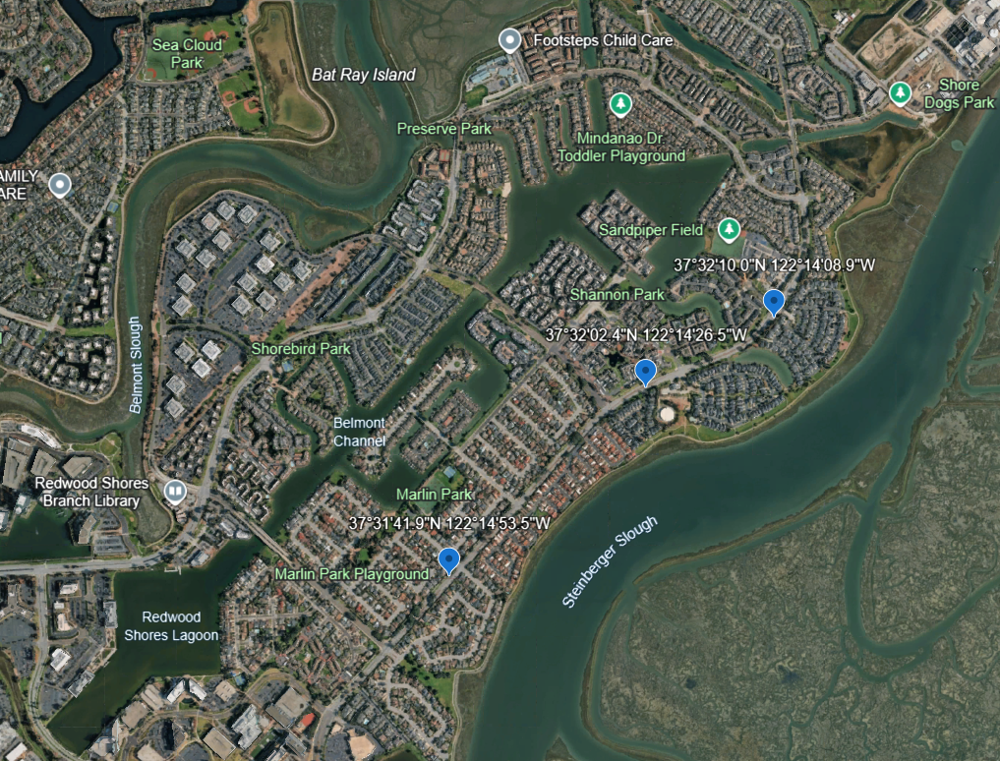

Figure 1 Locations of analyzed CPT profiles

## 2.3 Computational Implementation

All computational processes and analyses were executed within a Jupyter
Notebook environment, utilizing Python version 3.10 and the Visual
Studio Code editor. The core external libraries used for data handling
and model development include Numpy, Pandas, Torch (for the deep
learning autoencoder), Scikit-learn, Matplotlib, and SciPy. The complete
source code and instructions necessary for reproducibility are openly
available at:

<https://github.com/Drzyjiang/Soil-Layering-by-CPT-Data-and-Autoencoder>

## 2.4 Preprocessing

### 2.4.1 Data extraction

All CPT data files are regulated to .csv, while configuration parameters
and hyperparameters are stored in .txt format. Each CPT data file is
labeled corresponding to its sounding number and structured with column
headers of “Depth (ft)”, “Cone resistance (tsf)”, “Sleeve friction
(tsf)”, and “Pore pressure u2 (psi)”. A format preview of CPT data file
is provided in Figure 2.


Figure 2 Preview of .csv format used for CPT data in this project

The raw CPT profiles, following the necessary unit conversions, are
graphically presented in Figure 3. The extracted profile lengths, in
terms of the number of measurement rows, are 2,761, 3,661, and 2,751 for
Profile 452, 453, and 454, respectively.

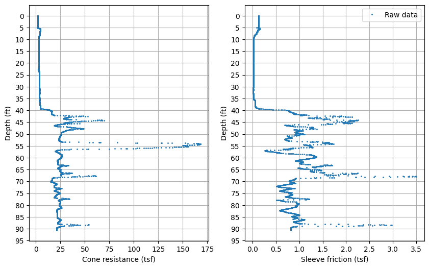

\(a\) Profile 452

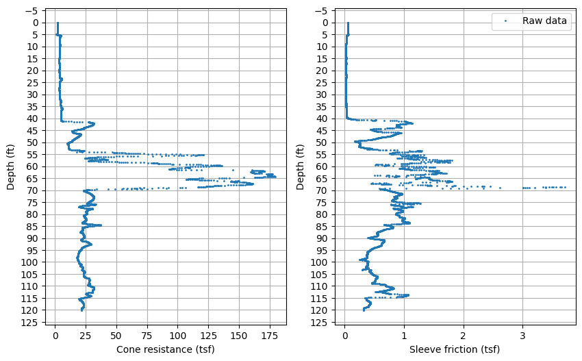

\(b\) Profile 453


\(c\) Profile 454

Figure 3 Raw CPT profiles in included in the analysis

### 2.4.2 CPT profile alignment

Profile alignment is a crucial preprocessing step, involving two
distinctive stages: an optional top-end alignment and a mandate
bottom-end alignment. The primary motivation for alignment is to ensure
that the input data tensor for the deep learning autoencoder has uniform
dimensions.

Top-End Alignment: The optional top-end alignment addresses variations
in the existing ground surface elevation or site-specific earthwork
(cut-and-fill operations) that may precede the CPT investigation. In
geotechnical practice, CPT profiles are often aligned by elevation
instead of depth to create a unified design profile across a site. The
alignment is implemented by shifting the profile by a desired offset,
which are stored in the file cptProfileOffsetRows.txt file and
calculated as the vertical shift divided by the CPT sampling interval. A
positive offset denotes a downward shift (e.g., lower original
elevation), and a negative offset denotes an upward shift. To facilitate
deep learning input, all offset values are normalized to be
non-negative. The new data slots created by the offset are filled by
padding with the top edge values of the profile. These padded values,
which do not represent actual measurements, are flagged as True in a
corresponding mask array. For simplicity in this project, and due to the
unavailability of existing ground surface elevation data, a zero offset
was uniformly applied for the top-end alignment.

Bottom-End Alignment: The alignment at bottom is necessitated by the
inherent variations in CPT profile lengths, typically caused by refusals
stiff strata or uneven bedrock elevation. Since the chosen deep neural
network architecture (Autoencoder) requires a consistent input size,
padding is required. A naive solution of truncation to the shortest
length would lead to a significant loss of data. Therefore, all CPT
profiles are padded to the length of the longest profile (3,661 data
points) using bottom edge values. The same mask array is utilized to
flag these bottom-padded regions. After this step, all three profiles
are of uniform length.

The conceptual of this CPT profile alignment process is presented in
Figure 4.


Figure 4 Conceptual illustration of CPT profile alignment

# 3. Autoencoder Training and Architecture

### 3.1 Training data preparation

Neural networks are sensitive to training data’s value range. If feature
values vary by magnitudes, after training the feature with less absolute
values tend to have higher relative error. With the same stress unit,
CPT cone resistance is typically two to three order higher than sleeve
friction. To reduce the substantial difference between features, each
profile’s cone resistance and sleeve friction are normalized and
confined in a range of \[0,1\] using the equations below:

``` math
standardized\ q_{c} = \frac{q_{c} - {min(q}_{c})}{\max\left( q_{c} \right) - min(q_{c})}
```

``` math
standardized\ f_{s} = \frac{f_{s} - {min(f}_{s})}{\max\left( f_{s} \right) - min(f_{s})}
```

Note that only cone resistance and sleeve friction are fed to deep
learning models. Pore pressure information has no relation with soil
units and thus is excluded. Depth information is also excluded to help
recognize and unify separated soil layers.

## 3.2 Autoencoder model architecture

An autoencoder (AE), an unsupervised (or self-supervised) deep learning
neural network, consists of a coupled encoder and decoder structure. The
encoder maps the input data to a lower-dimensional representation called
latent vector, or embedding, while the decoder attempts to reconstruct
the original input from this latent vector. The model is trained by
minimizing the reconstruction error between the input and final output.

In the context of dimensionality, when the dimensions of the latent
vector is smaller than the input dimension, the model is termed
undercomplete autoencoder and is primarily used for data compression. In
this project, an overcomplete autoencoder was employed, where the latent
vector dimension is intentionally higher than the input dimension
(implicitly, the final output layer is of the original input dimension).
This design choice is implemented to facilitate the learning of a more
complex, non-linear representation that efficiently captures the
structural relationships within the CPT data. Through this
compression-expansion process, the AE acts as a filter, removing noise
and extracting the fundamental commonalties of the input data as
parameters of the encoder and decoder, while preserving the unique
characteristics within the resulting latent vectors. These latent
vectors serve as the basis for the subsequent layering (clustering)
step. The AE was selected specifically for its ability to operate in
unsupervised manner, circumventing the need for pre-labeled training
data.

Custom Autoencoder Implementation

The specific autoencoder architecture utilized in this study is a custom
sequence-to-sequence model incorporating a Transformer encoder layer to
leverage its capabilities in handling sequential data.

The model structure is as follows:

- Encoder: Comprises a Linear layer followed by a Transformer Encoder
  layer.

- Decoder: Comprises a Linear layer, a Rectified Linear Unit (ReLU)
  activation layer, and a final linear layer.

The data shape transformation through the network is illustrated in
Figure 5.


Figure 5 Data flow and shape transformation with the Autoencoder
architecture

The Transformer architecture is highly effective for sequential data
analysis. Its core innovation is the self-attention mechanism, which
enables the model to dynamically weight the relative importance of all
tokens (or data points) within a sequence, contrasting with the
sequential processing of Recurrent Neural Networks (RNNs). Coupled with
positional encoding, which provides information on relative or absolute
position of each data point, the Transformer layer allows the model to
effectively understand long-range dependencies and context across the
entire CPT profile, which is crucial for identifying continuous soil
strata.

Training Parameters

The hyperparameters for the Transformer layer were set as follows: the
number of attention heads was specified as 4, and number of Transformer
encoder layers was set to 1.

A critical aspect of the training set was the incorporation of the mask
array generated during the preprocessing stage (Section 2.4.2). This
mask was fed to the model to prevent self-attention mechanism from
assigning weights or distribution attention to the padded,
non-geological data points, ensuring the model focuses only on the
actual CPT measurements.

The training was executed for 1,500 epochs, a value determined
empirically based on the convergence of the reconstruction error. The
mean squared error (MSE) was selected as the loss function, covering all
data points, including the padded portions (as the MSE calculation is
applied to the entire reconstructed profile). The Adam algorithm was
used for optimization. The training process utilized GPU for
acceleration. To ensure maximum reproducibility, all random state seeds
are mandated as zero. An early termination condition was defined as the
MSE falling below 1x10<sup>-5</sup>.

Model Validation

Upon completion of the training, the autoencoder model’s performance was
validated by comparing the original input data and reconstructed output.
As shown in Figure 6, all reconstructed profiles exhibit a strong match
with the training data. This indicates that the chosen autoencoder model
architecture, hyperparameters, and training regimen are acceptable for
capturing the underlying data structure.

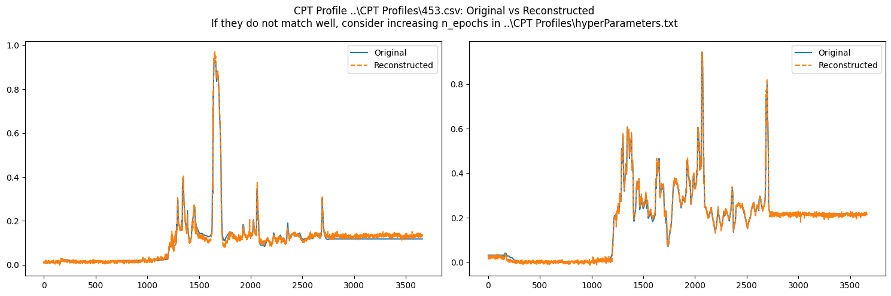

\(a\) CPT Profile 452


\(b\) CPT Profile 453

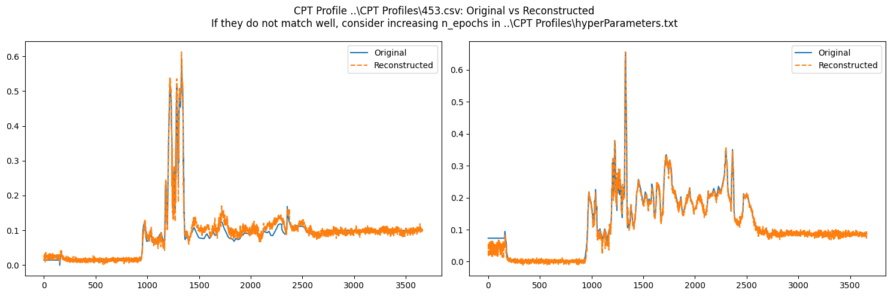

\(c\) CPT Profile 454

Figure 6 Comparison of training data (original) and reconstructed data
(output)

# 4. Post-processing and Layering

Following the training and validation of the autoencoder model (Section
3), the encoder component was utilized to generate the latent vectors of
the entire set of CPT profiles. For each pair of normalized cone
resistance and sleeve friction measurements, a latent vector of shape 1
x 64 was extracted. Crucially, the latent vectors corresponding to the
padded points (which do not represent geological material) were flagged
and excluded from all subsequent analysis.

4.1 Latent vector visualization with t-SNE

To explore the clustering tendencies within the high-dimensional latent
space, the t-Distribution Stochastic Neighbor Embedding (t-SNE)
algorithm was applied for dimensionality reduction and visualization.
t-SNE maps the 64-dimensional latent vectors onto a lower-dimensional
space, typical 2D or 3D, while preserving the local structure of the
data.

A key hyperparameter of t-SNE is perplexity, which balances attention
between local and global aspects of the data. A value of Perplexity = 30
was selected, which falls within the typical recommended range of 5 to
50.

The resulting 2D embeddings are presented in Figure 7. It is important
to note that the physical meaning of the resulting axis is
uninterpretable. Each data point is color-coded according to its depth
within the profile. The ideal outcome is for latent vectors belonging to
the same layer to exhibit proximity in the embedding space and possess
similar depth values.

For CPT Profile 452 (Figure 7a), three main groupings are discernible:
two large clusters and a smaller cluster. The right-side cluster,
identified by its color scale, comprises data points from the shallow
subsurface (approximately the top 30 ft), while central cluster includes
the majority of the remaining deep data points. A small portion of data
points corresponding to approximately 55 ft is clustered at the lower
left. A similar cluster pattern, albeit with closer spacing between the
two large clusters, is observed in CPT profiles 453 and 454 (Figure 7b
and Figure 7c).


\(a\) CPT Profile 452

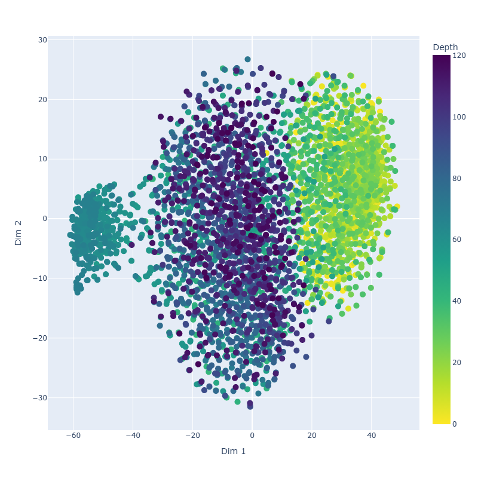

\(b\) CPT Profile 453


\(c\) CPT Profile 454

Figure 7 Visualization of CPT latent vectors by t-SNE in 2D

Ablation test for positional encoding

To confirm the role of the Transformer encoder layer in capturing the
sequential and contextual information of the CPT profile, an ablation
test was performed. The positional encoding (PE) was enforced as a
constant zero vector, effectively removing its contribution.

The resulting t-SNE plots (Figure 8) display a highly linear patten,
suggesting the model primarily learned the existence of continuous
latent variables corresponding to the original CPT measurements.
However, the distinct, non-linear cluster separation seen in Figure 7 is
lost, confirming the at the positional encoding and self-attention
mechanism are necessary for the autoencoder to effectively learn
long-distance sequence patterns critical for geological layering.

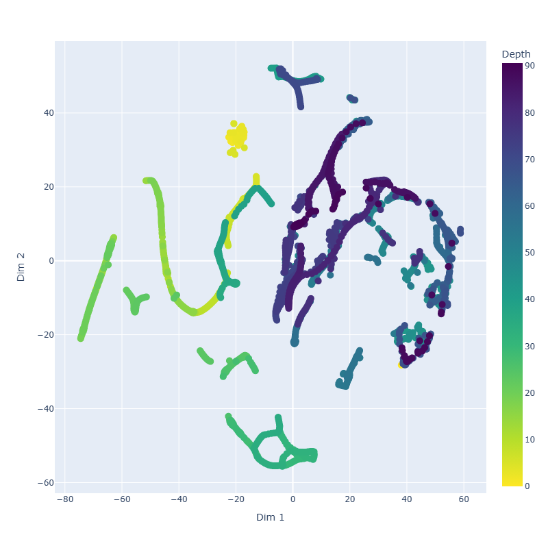

\(a\) CPT Profile 452

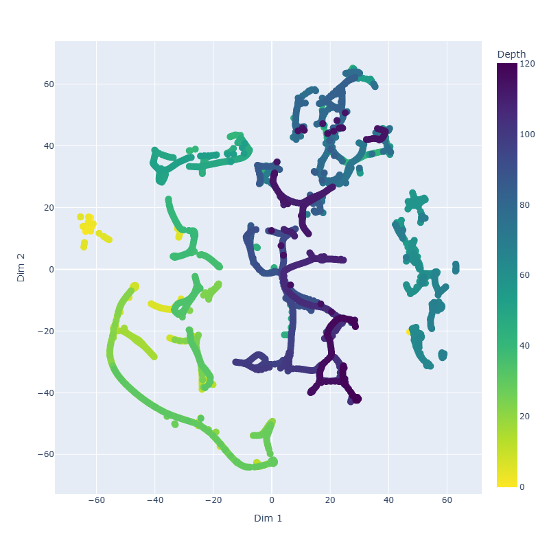

\(b\) CPT Profile 453

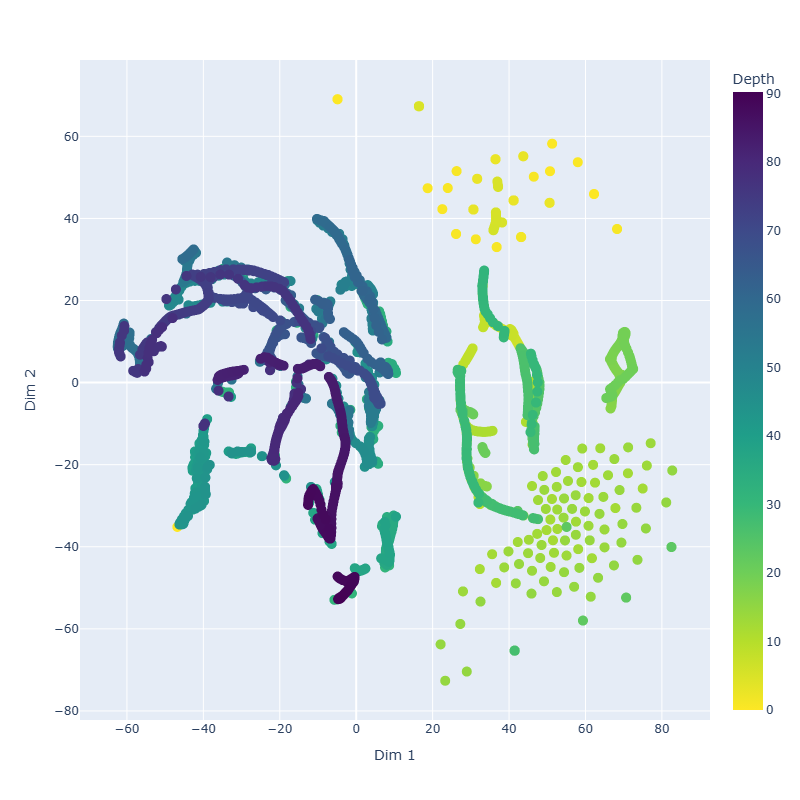

\(c\) CPT Profile 454

Figure 8 Visualization of CPT latent vectors resulting from autoencoder
model with constant zero PE

### 4.2 K-Means clustering 

The t-SNE visualization confirms that the autoencoder successfully
mapped CPT data points with similar geological properties into close
proximity within the latent space, which validates the subsequent use of
a distance-based clustering algorithm. K-Means clustering was applied to
the latent vectors to assign a pseudo-class label to each data point,
which serves as the fundamental input for the final layering process.

K-Means requires specifying the number of clusters, *k*. This parameter
was tuned using the Elbow Method applied to the Within-Cluster Sum of
Squares (WCSS). The WCSS is defined as:

``` math
= \sum_{= 1}^{}{\sum_{}^{}{{}_{_{}k}\left\| x_{n} - \mu_{k} \right\|^{2}}}
```

where $`x_{n}`$ is the latent vector for data point *n*;

$`\mu_{k}`$ is the centroid vector for cluster *k*;

$``$ is the total number of clusters;

$`_{}`$ is the Indicator Function.

``` math
_{}\left\{ \begin{array}{r}
 \\

\end{array} \right.\ 
```

As shown in Figure 9, the plot of WCSS versus the number of clusters
exhibits a clear “elbow” at K=3. Applying the elbow method, the optimal
number of latent clusters was determined to be three.

The resulting pseudo-class label assignment as a function of depth is
shown in Figure 10. Class 1 is predominantly located at shallow depths,
while Class 3 spans the greater depths. Class 0 occupies a narrow depth
range between approximately 40 ft and 70 ft, with rare outliners. Figure
11 further compliments this by showing the cumulative percentage of data
points assigned to each class along the depth profile. The analysis of
these figures confirms that the K-Means algorithm effectively clustered
the latent vectors into three distinct geotechnical property zones.

<figure>

<figcaption><p>Figure 9 Within-cluster sum of squares vs number of
clusters</p></figcaption>
</figure>

<figure>

<figcaption><p>Figure 10 Pseudo-class label assigned by K-Means versus
depth</p></figcaption>
</figure>

<figure>
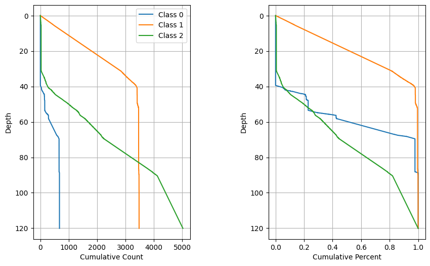
<figcaption><p>Figure 11 Cumulative percentage of each pseudo-class
along with increasing depth</p></figcaption>
</figure>

Visualizing the pseudo-class labels on the t-SNE plots (Figure 12)
demonstrates a strong spatial correspondence between K-Means assignments
and the visually separately clusters. Confirming the acceptability of
the chosen perplexity parameter (Perplexity = 30) for visualization.
Furthermore, the lack of significant interpenetration of data points
deep into another cluster confirms that the three pseudo-classes are
well-defined and non-redundant.

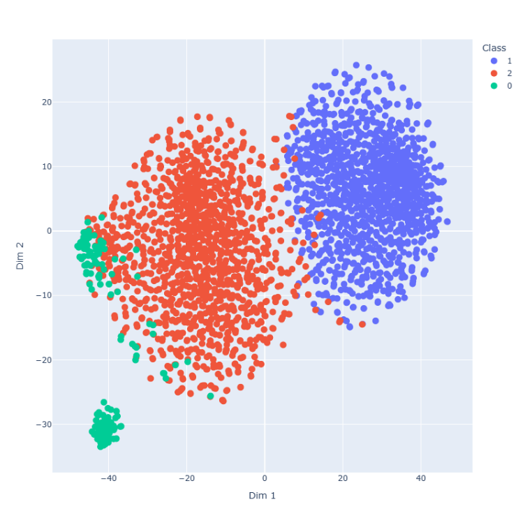

\(a\) CPT Profile 452


\(b\) CPT Profile 453

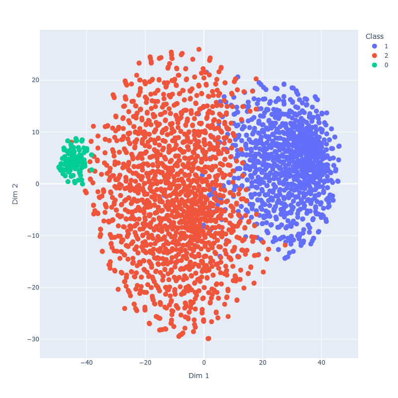

\(c\) CPT Profile 454

Figure 12 Visualization of pseudo class labels on t-SNE plot

4.3 Soil layering by Random Forests

With each data point now assigned a pseudo-class label, the final step
is to delineate the continuous soil layering for each individual CPT
profile using a modified Random Forests (RF) approach. The RF model is
an ensemble learning technique used here not for classification, but to
identify optimal splitting criteria (layer interfaces) that best
separate the depth-based classes.

The methodology is as follows:

1\. Feature and label definition: Depth is used as the sole feature, and
the K-Means pseudo-class label is used the target label.

2\. Splitting criterion: The model is constrained by setting the maximum
number of leaf nodes equal to the desired number of soil layers. Each
leaf node then ideally represents one soil layer.

3\. Gini impurity: The default Gini splitting criterion (used by
scikit-learn) is employed to maximize the homogeneity of the class
labels within each resulting split (layer). The Gini impurity, $`()`$,
for a node *m* is defined as:

``` math
G\left(_{} \right) = \sum_{}^{}_{}^{}\sum_{}^{}{_{}_{}}
```

where $`_{}^{}`$ is the proportion of data points belonging to class *k*
at node m. The split outcome seeks to minimize the weighted impurity
$``$:

``` math
\left(_{} \right)\frac{_{}}{_{}}()\frac{_{}}{_{}}()
```

$``$
``` math
_{}\frac{}{_{}}\sum_{_{}}^{}
```
$``$$``$ $`_{}`$ $`_{}`$
``` math
\left(_{} \right)\sum_{}^{}{_{}_{}}
```
``` math
\left(_{} \right)\frac{_{}^{}}{_{}}\left(_{}^{} \right)\frac{_{}^{}}{_{}}\left(_{}^{} \right)
```
where $`_{}`$and $`_{}`$ are the number of data points in the left (*L*)
and right (*R*) nodes resulting from the split $`_{}`$.

Tuning the number of layers

The number of layers is a critical hyperparameter. This was tuned by
maximizing the prediction accuracy, defined as the percentage of data
points whose pseudo-class matches the majority class of their final leaf
node. Accuracy is bounded by zero and unity. To avoid overfitting and
excessive layering, the Elbow Method was applied to the prediction
accuracy plot (Figure 13).

``` math
accuracy(y,\widehat{y}) = \frac{1}{n_{sample}}\sum_{i = 0}^{n_{sample} - 1}{1(y_{i} = \widehat{y_{i}})}\ 
```

The result, displayed in Figure 13, suggests that four soil layers are
appropriate, as the gain in accuracy diminishes significantly
thereafter.

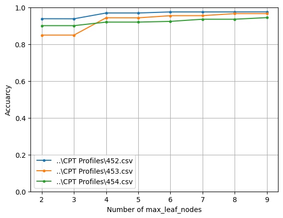

Figure 13 Tuning the number of layers using the Elbow method on
prediction accuracy

Final layering and confidence assessment

Once the number of layers was set to four, the three resulting soil
interface depths were extracted from the split thresholds (non-leaf
nodes) of the trained Random Forests model. These interface depths are
provided in Table 1.

The layer-specific class label was then determined by the majority
pseudo-class within that depth interval. The confidence in the
assignment was quantified using the majority percentage and the Entropy
(H) of the pseudo-class labels within the layer:

``` math
()\sum_{}^{}{_{}_{}_{}}
```

where $`_{}`$ is the proportion of class k in the layer. Lower entropy
$`_{}^{}`$indicate higher purity and greater confidence. Table 2
provides the majority percentage and entropy for each resulting layer.
For CPT Profile 453, Layer 1 has a lower majority percentage (72%) and
high entropy (0.78), likely corresponding to a thin, mixed, or
transitional zone.

Finally, a Global Class Number was assigned to each layer (e.g., Layer 0
across all profile is Global Class 0) to unify soil properties across
the entire site. The resulting final soil layering, depicting in Figure
14, demonstrates the method’s capability to use the latent vector’s
inherent similarity (i.e., the pseudo-class labels) to associate and
unify soil layers across different CPT profiles, such as the top layer
(Global Class 2) being consistently identified across all three
soundings.

<table>
<caption><p>Table 1 Depths of soil interface</p></caption>
<colgroup>
<col style="width: 27%" />
<col style="width: 26%" />
<col style="width: 22%" />
<col style="width: 22%" />
</colgroup>
<thead>
<tr>
<th style="text-align: center;"></th>
<th colspan="3" style="text-align: center;">Soil Interface Depth
(ft)</th>
</tr>
</thead>
<tbody>
<tr>
<td style="text-align: center;">Interface No.</td>
<td style="text-align: center;">CPT Profile 452</td>
<td style="text-align: center;">CPT profile 453</td>
<td style="text-align: center;">CPT profile 454</td>
</tr>
<tr>
<td style="text-align: center;">0</td>
<td style="text-align: center;">39.5</td>
<td style="text-align: center;">40.7</td>
<td style="text-align: center;">31.5</td>
</tr>
<tr>
<td style="text-align: center;">1</td>
<td style="text-align: center;">53.4</td>
<td style="text-align: center;">58.1</td>
<td style="text-align: center;">39.4</td>
</tr>
<tr>
<td style="text-align: center;">2</td>
<td style="text-align: center;">56.5</td>
<td style="text-align: center;">69.6</td>
<td style="text-align: center;">44.3</td>
</tr>
</tbody>
</table>

<table>
<caption><p>Table 2 Confidence in accuracy of soil
layering</p></caption>
<colgroup>
<col style="width: 8%" />
<col style="width: 18%" />
<col style="width: 15%" />
<col style="width: 17%" />
<col style="width: 11%" />
<col style="width: 17%" />
<col style="width: 11%" />
</colgroup>
<thead>
<tr>
<th style="text-align: center;"></th>
<th colspan="2" style="text-align: center;">CPT Profile 452</th>
<th colspan="2" style="text-align: center;">CPT profile 453</th>
<th colspan="2" style="text-align: center;">CPT profile 454</th>
</tr>
</thead>
<tbody>
<tr>
<td style="text-align: center;">Layer No.</td>
<td style="text-align: center;">Majority percentage (%)</td>
<td style="text-align: center;">Entropy</td>
<td style="text-align: center;">Majority percentage (%)</td>
<td style="text-align: center;">Entropy</td>
<td style="text-align: center;">Majority percentage (%)</td>
<td style="text-align: center;">Entropy</td>
</tr>
<tr>
<td style="text-align: center;">0</td>
<td style="text-align: center;">100</td>
<td style="text-align: center;">0.03</td>
<td style="text-align: center;">99</td>
<td style="text-align: center;">0.04</td>
<td style="text-align: center;">99</td>
<td style="text-align: center;">0.04</td>
</tr>
<tr>
<td style="text-align: center;">1</td>
<td style="text-align: center;">90</td>
<td style="text-align: center;">0.33</td>
<td style="text-align: center;">72</td>
<td style="text-align: center;">0.78</td>
<td style="text-align: center;">60</td>
<td style="text-align: center;">0.70</td>
</tr>
<tr>
<td style="text-align: center;">2</td>
<td style="text-align: center;">96</td>
<td style="text-align: center;">0.18</td>
<td style="text-align: center;">98</td>
<td style="text-align: center;">0.09</td>
<td style="text-align: center;">74</td>
<td style="text-align: center;">0.58</td>
</tr>
<tr>
<td style="text-align: center;">3</td>
<td style="text-align: center;">96</td>
<td style="text-align: center;">0.18</td>
<td style="text-align: center;">94</td>
<td style="text-align: center;">0.23</td>
<td style="text-align: center;">95</td>
<td style="text-align: center;">0.21</td>
</tr>
</tbody>
</table>


\(a\) CPT Profile 452

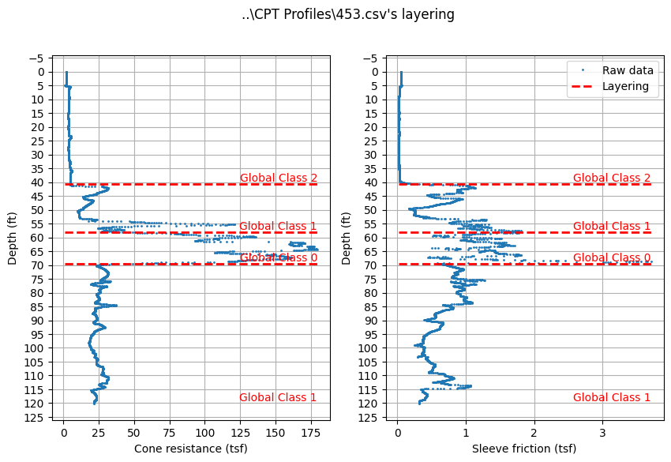

\(b\) CPT Profile 453

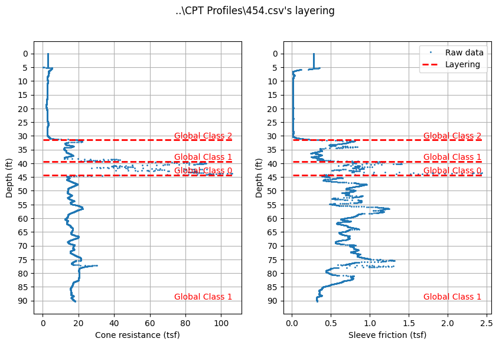

\(c\) CPT Profile 454

Figure 14 Final soil layering of each CPT profile

# 5. Verification

The verification of automated soil layering results necessitates
supplementary geotechnical input and expert human judgement. In standard
practice, soil stratification is determined holistically through the
review of multiple data sources, such as Standard Penetration Test (SPT)
blow counts, laboratory results (e.g., gradation, Atterberg limits,
moisture content), and shear strength parameters. In the absence of such
supplementary data for the selected profiles, the layering derived from
the autoencoder-based clustering was benchmarked against:

1\. Established CPT interpretation software: The industry-standard
software package CPeT-IT was used to generate classical CPT
interpretations. CPeT-IT performs data manipulation, correlation, and
visualization based on widely accepted empirical relationships.

2\. Professional geotechnical judgement: A reference interpretation was
established by a professional geotechnical engineer leveraging domain
expertise and empirical experience on the CPT profiles.

Three key interpretated variables - Soil Behavior Type Index
(*I<sub>c</sub>*), Normalized Soil Behavior Type (SBT<sub>n</sub>), and
Undrained Shear Strength (s<sub>u</sub>) – were generated by CpeT-IT and
are presented in a fence plot format with soil interfaces overlayed
(Figure 15).

Comparative Results

The CPeT-IT interpretation of CPT Profile 452 indicates that the top
approximately 40 ft is composed primarily of clay with interbedded silty
clay. The SBT<sub>n</sub> further delineates a zone of sensitive clay
ranging from 24 to 35 ft. Between 40 and 90 ft, the primary lithology is
silty clay and clay, but characterized by a significantly higher
s<sub>u</sub>. Notably, a thin silty sand layer is observed between 54
ft and 57 ft depth. Similar soil layering patterns and property
contrasts are recognized in CPT profiles 453 and 454.

A comparative assessment between the soil layering obtained via the
proposed unsupervised machine learning methodology (Section 4.3) and the
established CPT interpretations (Figure 15) shows satisfactory and
consistent match. Specifically, the autoencoder-based model successfully
captured the following critical features:

1\. Recognition of thin interbeds: the model-derived interfaces
successfully delineate the relatively thin, interbedded silty sand layer
located around 55 ft depth (e.g., Layer 2 in Table 1 for Profile 452 and
454), which is often challenging for simpler clustering algorithms to
isolate.

2\. Property-based stratification: The layer interfaces (e.g., Interface
0 at ~40 ft in Table 1) effectively differentiate the upper,
lower-strength clay form the deeper clay/silty clay with significantly
higher undrained shear strength. This confirms that the latent vectors
learned by the autoencoder are not simply clustering based on raw
*q<sub>c</sub>* and *f<sub>s</sub>* values, but are capturing complex
geotechnical differences that manifest in interpreted parameters like
s<sub>u</sub>.

This agreement provides robust verification that the autoencoder-based
approach generates a soil stratification that is geotechnically
meaningful and aligns well with both empirical correlation software and
professional judgement.


1)  CPT Profile 452


2)  CPT Profile 453


3)  CPT Profile 454

Figure 15 Fence plot visualization of CPT interpretation variables from
CPeT-IT software

# 6. Conclusions

This study successfully investigated and demonstrated a novel framework
utilizing a deep learning autoencoder for the automated segmentation and
layering of soil profiles based on Cone Penetration Test (CPT) data. The
proposed methodology is designed to address key limitations of prior
machine learning approaches, including noise susceptibility and the
inability to handle profile misalignment.

6.1 Summary of Methodology and Findings

The developed methodology consists of the following systematic steps:

1\. Preprocessing: CPT profiles were aligned and padded to ensure
consistent input dimensions, with padded regions masked to prevent model
interference.

2\. Feature extraction: an autoencoder architecture featuring a
Transformer encoder layer was trained in an unsupervised manner on
normalized cone resistance (*q<sub>c</sub>*) and sleeve friction
(*f<sub>s</sub>*). The Transformer’s self-attention mechanism, combined
with positional encoding, proved critical for learning long-range,
depth-independent sequential patterns and generating robust latent
vector representations.

3\. Clustering: The latent vectors were clustered using the K-Means
algorithm to assign a pseudo-class label to each CPT measurement point,
effectively grouping data points with similar latent geotechnical
properties. The optimal number of clusters (K=3) was determined using
the Elbow Method.

4\. Layer delineation: The final soil layer interfaces were determined
by applying a constrained Random Forests model, which used depth as the
feature and the pseudo-class label as the target. The model was
constrained to identify the optimal splits (layer boundaries) by setting
the maximum leaf nodes based on an elbow analysis of prediction accuracy
(N=4 layers).

6.2 Verification and Contribution

Verification against CPT interpretation software (CPeT-IT) and expert
geotechnical judgement confirmed the satisfactory and geotechnically
meaningful nature of the results. Specifically, the framework was able
to:

- Capture Thin, Transitional Layer: Successfully delineate thin,
  interbedded layers (e.g., silty sand layer) that often pose a
  challenge for traditional or simpler classification methods.

- Identify Property-Driven Boundaries: Establish layer interfaces that
  correspond to significant changes in interpreted geotechnical
  properties, such as large variations in undrained shear strength
  (*s<sub>u</sub>*), validating that the latent space captures
  geological substance beyond raw measurements.

- Address Misalignment: By excluding depth from the autoencoder
  training, the derived pseudo-class labels inherently possess the
  potential to unify and recognize the same soil layer across different
  depths or profiles, fulfilling a primary objective of the study.

6.3 Future Work

This project demonstrates the feasibility and effectiveness of
introducing deep learning autoencoders as a promising unsupervised
technique for geotechnical site characterization. The findings lay a
crucial groundwork for the development of more robust and automated
subsurface characterization frameworks. Future work will focus on:

1\. Extending the validation to a larger, geologically diverse dataset
to test the generalizability of the learned latent features.

2\. Incorporating the spatial coordinates of the CPT soundings to fully
leverage the inter-profile recognition capabilities of the latent
vectors for 3D subsurface modeling.

3\. Investigating techniques to integrate the vertical continuity
constraint directly into the autoencoder loss function rather than
relying on the subsequent Random Forests step.

# 7. References

1\. Sanger, M., M. Geyin, A. Shin, B. Maurer (2024). *A Database of Cone
Penetration Tests from North America*.
DesignSafe-CI. <https://doi.org/10.17603/ds2-gqjm-t836>

2\. Geotechnical Consultants, Inc. (2015). Preliminary Characterization
of Subsurface Condition, SVCW Clean Water Tunnel – Alignment 4BE,
Redwood City, California.

3\. Jiang, Z. Machine Learning in Geotechnical Engineering – Soil
Layering by Cone Penetration Test Data.
<https://github.com/Drzyjiang/ML-in-Geotechnical-Engineering/tree/main/Soil%20Layering%20by%20Cone%20Penetration%20Test%20Data>,
accessed on September 20, 2025.
